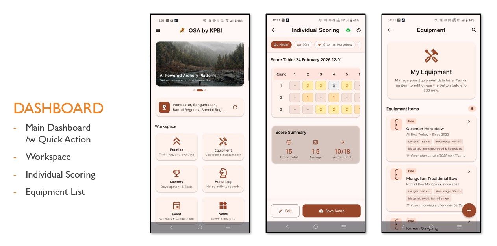

# Super App Boilerplate

Super App adalah aplikasi mobile (Android & iOS) yang dibangun dengan arsitektur Clean Architecture, menggunakan Material 3, dan mendukung multi-bahasa serta multi-template.

**Org:** id.carik.superapp_demo

## Screenshot



*Main dashboard showing banner carousel, quick actions, and workspace icons including Super Module*

---

## 📁 Struktur Folder (Clean Architecture)

```
lib/
├── core/                           # Inti aplikasi (TIDAK DIUBAH)
│   ├── auth/
│   │   ├── auth_interface.dart     # BaseAuthService (Abstract Class)
│   │   ├── firebase_provider.dart  # Implementasi Firebase Auth
│   │   └── custom_api_provider.dart # Implementasi Custom API Auth
│   ├── config/
│   │   └── app_config.dart         # Riverpod providers & config
│   ├── constants/
│   │   ├── app_info.dart           # App info & branding configuration
│   │   └── assets.dart             # Path assets
│   ├── gps/                        # GPS & Location services
│   ├── l10n/                       # Localization
│   ├── network/                    # Network layer (Dio + Retrofit)
│   ├── notification/               # Push notification services
│   ├── routes/
│   │   └── app_router.dart         # GoRouter navigation
│   ├── services/                   # Core services
│   ├── theme/
│   │   └── app_theme.dart          # Material 3 themes & templates
│   └── utils/                      # Utility functions
│
├── modules/                        # Pluggable modules
│   ├── all_modules.dart            # Module manifest (auto-generated)
│   ├── module_base.dart            # Abstract module class
│   ├── module_registry.dart        # Module registration & management
│   ├── modules.dart                # Module exports
│   ├── navigation_item.dart        # Navigation item model
│   ├── quick_action_item.dart      # Quick action item model
│   └── [module_name]/              # Setiap modul self-contained
│       ├── [name]_module.dart      # Module entry point
│       ├── screens/                # UI screens
│       └── widgets/                # Module-specific widgets
│
├── features/                       # Built-in core features
│   ├── auth/
│   │   ├── login_screen.dart       # Login dengan Email/Google
│   │   └── register_screen.dart    # Registrasi
│   ├── dashboard/
│   │   ├── main_dashboard.dart     # Halaman utama
│   │   ├── providers/              # Dashboard state providers
│   │   ├── screens/                # Additional screens
│   │   └── widgets/
│   │       ├── banner_carousel.dart # Top banner (carousel)
│   │       ├── menu_grid.dart       # Grid ikon modul
│   │       └── article_list.dart    # Section artikel
│   ├── profile/
│   │   └── profile_screen.dart     # Detail profil
│   ├── settings/
│   │   └── setting_screen.dart     # Pengaturan bahasa & template
│   └── splash/
│       └── splash_screen.dart      # Splash screen full screen
│
├── shared/                         # Komponen global
│   ├── info/
│   │   ├── help_screen.dart        # Help & Report
│   │   ├── tos_screen.dart         # Terms of Service
│   │   └── privacy_screen.dart     # Privacy Policy
│   └── widgets/
│       ├── custom_header.dart      # Header dinamis (AppBar/SliverAppBar)
│       ├── custom_footer.dart      # Footer NavigationBar + center FAB
│       ├── custom_sidebar.dart     # NavigationDrawer Material 3
│       ├── location_display_widget.dart # GPS location display
│       ├── module_dashboard_slots.dart # Dashboard widget slots
│       ├── notification_banner.dart # Notification banner widget
│       └── workspace_icon.dart     # Workspace icon widget
│
└── main.dart                       # Entry point dengan Riverpod
```

> **Note:** Konfigurasi branding (colors, company info, social links, legal URLs) sudah terintegrasi di `lib/core/constants/app_info.dart`

> **📚 Architecture Overview:** Untuk gambaran arsitektur lengkap, lihat [docs/SuperApp-Architecture.md](docs/SuperApp-Architecture.md)

---

## ✨ Fitur yang Diimplementasi

| Fitur | Status | Deskripsi |
|-------|--------|-----------|
| **Material 3** | ✅ | `useMaterial3: true` dengan ColorScheme.fromSeed |
| **Auth Abstraction** | ✅ | `BaseAuthService` + Firebase & Custom API providers |
| **Multi-Template** | ✅ | 6 tema: Blue, Purple, Green, Orange, Brown, Dark Mode |
| **Multi-Bahasa** | ✅ | Locale ID & EN dengan flutter_localizations |
| **Sidebar Configurable** | ✅ | Posisi kiri/kanan dapat dikonfigurasi |
| **Footer dengan FAB** | ✅ | 5 tombol dengan center button dominan |
| **Splash Screen** | ✅ | Full screen dengan animasi |
| **Dashboard** | ✅ | Banner Carousel + Menu Grid + Articles |
| **State Management** | ✅ | Flutter Riverpod |
| **Routing** | ✅ | GoRouter |
| **Edge-to-Edge** | ✅ | SystemUiMode.edgeToEdge |
| **Network Layer** | ✅ | Dio + Retrofit dengan Repository Pattern (lihat [docs/API.md](docs/API.md)) |
| **Push Notification** | ✅ | Multi-provider (FCM, OneSignal, Mock) dengan abstraction layer (lihat [docs/Notification.md](docs/Notification.md)) |
| **Modular Architecture** | ✅ | Plugin-based module system dengan dynamic routes & dashboard slots (lihat [docs/Modular.md](docs/Modular.md)) |
| **External Modules** | ✅ | Integrasi modul eksternal tanpa edit repo utama (lihat [docs/SubModule.md](docs/SubModule.md)) |
| **Environment Config** | ✅ | Konfigurasi via `.env` file dengan `flutter_dotenv` |
| **GPS & Location** | ✅ | Geolocator + URL launcher untuk integrasi maps |
| **Google Sign-In** | ✅ | OAuth authentication dengan `google_sign_in` |
| **WordPress API** | ✅ | Full support untuk WordPress REST API dengan JWT Auth (lihat [docs/API.md](docs/API.md)) |

---

## 🛠️ Dependencies

```yaml
dependencies:
  flutter_riverpod: ^2.6.1      # State Management
  go_router: ^17.0.1            # Navigation
  google_fonts: ^6.2.1          # Typography
  carousel_slider: ^5.0.0       # Banner carousel
  cached_network_image: ^3.4.1  # Image caching
  flutter_localizations         # i18n support
  intl: ^0.20.2                 # Localization utilities
  shared_preferences: ^2.3.4    # Local storage
  cupertino_icons: ^1.0.8       # Icons
  dio: ^5.4.0                   # HTTP Client
  retrofit: ^4.1.0              # Type-safe API
  json_annotation: ^4.8.1       # JSON serialization
  connectivity_plus: ^7.0.0     # Network connectivity
  permission_handler: ^12.0.1   # Permission management
  image_picker: ^1.0.7          # Camera & Gallery
  geolocator: ^13.0.2           # GPS & Location
  url_launcher: ^6.2.5          # Open URLs (Maps, etc.)
  flutter_local_notifications: ^19.5.0  # Local notifications
  google_sign_in: ^7.2.0        # Google OAuth
  flutter_dotenv: ^5.2.1        # Environment configuration
  package_info_plus: ^8.0.0     # App version info
  module_interface: (local)     # Shared module interface
  # firebase_core: (optional)   # Firebase Core - disabled by default
  # firebase_messaging: (optional)  # FCM - disabled by default
  # onesignal_flutter: (optional)   # OneSignal - disabled by default
```

---

## 🔐 Permissions

Aplikasi ini membutuhkan beberapa permission untuk berfungsi dengan baik:

### Android Permissions (AndroidManifest.xml)

| Permission | Kategori | Deskripsi |
|------------|----------|-----------|
| `READ_EXTERNAL_STORAGE` | Storage | Membaca file dari penyimpanan |
| `WRITE_EXTERNAL_STORAGE` | Storage | Menulis file ke penyimpanan |
| `MANAGE_EXTERNAL_STORAGE` | Storage | Akses penuh storage (Android 11+) |
| `CAMERA` | Kamera | Mengambil foto menggunakan kamera |
| `READ_MEDIA_IMAGES` | Gallery | Akses gambar dari gallery (Android 13+) |
| `ACCESS_FINE_LOCATION` | GPS | Lokasi presisi tinggi (GPS) |
| `ACCESS_COARSE_LOCATION` | GPS | Lokasi perkiraan (Network) |

📚 **Panduan penggunaan Permission Helper:** [`docs/Permission Helper.md`](docs/Permission%20Helper.md)

---

## 📡 Network Layer (Dio + Retrofit)

Network layer yang reusable dengan **Repository Pattern**, menggunakan **Dio** dan **Retrofit**.

### Struktur

```
lib/core/network/
├── api_config.dart              # Konfigurasi base URL & environment
├── api_client.dart              # Dio instance terpusat + providers
├── network.dart                 # Barrel export
├── connectivity/
│   └── connectivity_provider.dart # Network connectivity monitoring
├── exceptions/
│   └── api_exception.dart       # Unified exception handling
├── interceptors/
│   ├── auth_interceptor.dart    # Auto token injection & refresh
│   ├── logging_interceptor.dart # Request/response logging
│   └── error_interceptor.dart   # Error handling & retry
├── models/
│   ├── base_request.dart        # Shared request fields
│   └── base_response.dart       # Standardized response wrapper
├── repository/
│   ├── base_repository.dart     # Base repository (GET, POST, PUT, DELETE)
│   ├── user_repository.dart     # User API repository
│   ├── article_repository.dart  # Article API repository
│   └── banner_repository.dart   # Banner API repository
└── services/
    ├── api_service.dart         # Retrofit API definitions
    └── api_service.g.dart       # Generated Retrofit implementation
```

### ✨ Fitur Unggulan

| Fitur | Deskripsi |
|-------|-----------|
| **Auto Auth Headers** | Token `Authorization: Bearer` ditambahkan otomatis |
| **Token Refresh** | Otomatis refresh token saat 401 |
| **Common Headers** | `X-Request-ID`, `X-Timestamp`, `X-Platform` selalu ditambahkan |
| **Retry Logic** | Auto-retry untuk timeout dan error 5xx dengan exponential backoff |
| **Unified Error** | Semua error dikonversi ke `ApiException` |
| **Structured Logging** | Log request/response di debug mode |
| **BaseRequest** | Field shared (deviceId, timestamp, locale) untuk semua request |
| **BaseResponse** | Wrapper standar dengan support pagination |
| **Connectivity Monitoring** | Deteksi status koneksi jaringan secara real-time |
| **External Modules** | Integrasi modul eksternal tanpa mengubah repository utama (lihat [docs/SubModule.md](docs/SubModule.md)) |

### 🚫 Anti-Pattern yang Dihindari

Arsitektur network layer ini dirancang untuk menghindari anti-pattern umum:

| ❌ Anti-Pattern | ✅ Solusi yang Diterapkan |
|-----------------|---------------------------|
| **Passing headers manual di setiap API call** | Interceptors otomatis menambahkan semua headers (Auth, Content-Type, dsb) |
| **UI/Screen Inheritance** | Tidak ada inheritance di layer UI; network layer terpisah sepenuhnya |
| **Duplikasi error handling** | `ApiException` + `ErrorInterceptor` menangani semua error secara terpusat |
| **Hardcoded base URL** | `ApiConfig` + `EnvironmentConfig` untuk konfigurasi per-environment |
| **Token management tersebar** | `TokenStorage` abstraction dengan satu source of truth |
| **Refactoring existing screens** | Layer network 100% additive, tidak mengubah UI existing |
| **Membuat Dio instance baru** | Singleton `ApiClient` via Riverpod provider |
| **Request boilerplate berulang** | `BaseRepository` menyediakan method standar (get, post, put, patch, delete) |
| **Manual bot protection handling** | `fetchWithCloudflareRetry()` otomatis deteksi & retry untuk Cloudflare/Imunify360 |
| **Edit main repo untuk module baru** | External modules dengan `modules.yaml` - repo utama tetap bersih |

### 📖 Quick Example

**Basic Repository:**

```dart
// 1. Import
import 'package:super_app/core/network/network.dart';

// 2. Buat repository
class ProductRepository extends BaseRepository {
  ProductRepository({required super.apiClient});

  Future<BaseResponse<Product>> getProduct(String id) async {
    return get<Product>('/products/$id', parser: Product.fromJson);
  }

  Future<BaseResponse<Product>> createProduct(Product product) async {
    return post<Product>('/products', data: product.toJson(), parser: Product.fromJson);
  }
}

// 3. Registrasi provider
final productRepoProvider = Provider((ref) =>
  ProductRepository(apiClient: ref.watch(apiClientProvider))
);

// 4. Gunakan di widget - TANPA passing headers manual!
final response = await ref.read(productRepoProvider).getProduct('123');
if (response.success) {
  print(response.data);
}
```

**Dengan Bot Protection Retry:**

```dart
// Untuk API yang sering kena Cloudflare/Imunify360
Future<List<Banner>> getBanners() async {
  final response = await fetchWithCloudflareRetry(
    () => dio.get('https://api.example.com/banners'),
    apiName: 'Banner API',
    maxRetries: 3,
    retryDelayMs: 2000,
  );
  // Parse response...
}
```

**File Upload:**

```dart
final response = await uploadFile<UploadResult>(
  '/uploads',
  filePath: '/path/to/image.jpg',
  fieldName: 'file',
  additionalData: {'type': 'profile'},
  parser: UploadResult.fromJson,
  onProgress: (sent, total) => print('${sent / total * 100}%'),
);
```

📚 **Dokumentasi lengkap:** [`docs/API.md`](docs/API.md)

## 🌐 WordPress API Support

Boilerplate ini memiliki **dukungan penuh untuk WordPress REST API**, termasuk autentikasi dengan **JWT (JSON Web Token)**.

| Fitur | Deskripsi |
|-------|-----------|
| **Auto-Detection** | Otomatis mendeteksi backend WordPress via `/wp-json/` |
| **JWT Authentication** | Login via WordPress JWT Auth plugin |
| **User Profile Sync** | Otomatis fetch profil dari `/wp-json/wp/v2/users/me` |
| **Avatar Support** | Mapping avatar URL dari WordPress Gravatar |

📚 **Dokumentasi lengkap:** [`docs/WordPress.md`](docs/WordPress.md)

## 🔔 Push Notification (Multi-Provider)

Push notification layer yang reusable dengan **Multi-Provider Abstraction**, memungkinkan pergantian provider tanpa mengubah kode UI.

### ✨ Keunggulan

| Fitur | Deskripsi |
|-------|-----------|
| **Clean Separation** | Tidak ada `if (isFcm)` logic di UI layer |
| **1-Line Switch** | Ganti provider cukup ubah 1 baris di `app_info.dart` |
| **A/B Testing Ready** | Bisa dikontrol via remote config |
| **Testable** | `MockNotificationService` untuk unit testing |
| **Clean Architecture** | Konsisten dengan arsitektur aplikasi |

### ⚡ Quick Configuration

Semua konfigurasi ada di `lib/core/constants/app_info.dart`:

```dart
// Enable/disable notification
static const bool enableNotification = true;

// Pilih provider: 'firebase', 'onesignal', atau 'mock'
static const String notificationProvider = 'firebase';
```

### Provider yang Tersedia

| Value | Provider | Keterangan |
|-------|----------|------------|
| `firebase` / `fcm` | Firebase Cloud Messaging | Default, dari Google |
| `onesignal` | OneSignal | Alternatif populer |
| `mock` / `test` | Mock Service | Untuk testing |

📚 **Dokumentasi lengkap:** [`docs/Notification.md`](docs/Notification.md)

## 📱 Screen List

### Authentication
- **Splash Screen** - Full screen dengan logo dan animasi loading
- **Login Screen** - Login dengan Email/Password dan Google OAuth
- **Register Screen** - Registrasi dengan form dan Terms Agreement

### Main App
- **Main Dashboard** - Komponen: Header, Banner Carousel, Menu Grid, Article List, Footer
- **Profile Screen** - Detail profil user dengan quick actions
- **Settings Screen** - Pengaturan bahasa, template, sidebar position, auth strategy

### Info Pages
- **Help Screen** - FAQ dan contact support
- **Terms of Service** - Halaman TOS
- **Privacy Policy** - Halaman privacy policy

---

## 🔧 Configuration (app_config.dart)

File `lib/core/config/app_config.dart` mengontrol:

1. **authStrategy**: `AuthStrategy.firebase` | `AuthStrategy.customApi`
2. **sidebarPosition**: `SidebarPosition.left` | `SidebarPosition.right`
3. **currentTemplate**: `AppTemplate.defaultBlue` | `modernPurple` | `elegantGreen` | `warmOrange` | `sweetBrown` | `darkMode`
4. **selectedLocale**: `Locale('id', 'ID')` | `Locale('en', 'US')`
5. **isDarkMode**: `true` | `false`

---

## 🎨 Theme Templates

| Template | Seed Color | Deskripsi |
|----------|------------|-----------|
| Default Blue | `#1565C0` | Tema biru profesional |
| Modern Purple | `#7B1FA2` | Tema ungu modern |
| Elegant Green | `#2E7D32` | Tema hijau elegan |
| Warm Orange | `#E65100` | Tema oranye hangat |
| Sweet Brown | `#8D6E63` | Tema coklat manis |
| Dark Mode | `#6750A4` | Mode gelap |

---

## 🚀 Cara Menjalankan

```bash
# Install dependencies
flutter pub get

# Jalankan di debug mode
flutter run

# Build APK
flutter build apk

# Build iOS
flutter build ios
```

---

## 📦 Release & Keystore

Proyek ini menggunakan **custom keystore** untuk konsistensi signing di seluruh tim development.

### Keystore Files

| File | Deskripsi | Masuk Repo? |
|------|-----------|-------------|
| `android/keystores/debug.keystore` | Debug keystore untuk development | ✅ Ya |
| `android/keystores/release.keystore` | Release keystore (rahasia) | ❌ Tidak |
| `android/key.properties.example` | Template konfigurasi | ✅ Ya |
| `android/key.properties` | Konfigurasi aktif (rahasia) | ❌ Tidak |

### Quick Start

```bash
# 1. Copy template key.properties
copy android\key.properties.example android\key.properties

# 2. Edit android/key.properties dengan password release Anda

# 3. Generate debug keystore (jika belum ada)
keytool -genkey -v -keystore android/keystores/debug.keystore -alias androiddebugkey -keyalg RSA -keysize 2048 -validity 10000 -storepass android -keypass android -dname "CN=Android Debug,O=Android,C=US"

# 4. Generate release keystore
dart run tool/generate_release_keystore.dart

# 5. Build APK
flutter build apk --debug    # Debug build
flutter build apk --release  # Release build

# 6. Build App Bundle untuk Play Store
flutter build appbundle
```

> ⚠️ **PENTING:** Jangan pernah commit `key.properties` dan `release.keystore` ke repository!
>
> ✅ **Debug keystore** (`debug.keystore`) AMAN untuk dicommit karena menggunakan password standar Android (`android`).

📚 **Dokumentasi lengkap:** [`docs/Release.md`](docs/Release.md)

---

## 📱 Menjalankan di Android Emulator

### Langkah 1: Cek Emulator yang Tersedia
```bash
flutter emulators
```

### Langkah 2: Jalankan Emulator
```bash
# Ganti <emulator_id> dengan ID emulator yang tersedia
flutter emulators --launch <emulator_id>

# Contoh:
flutter emulators --launch Medium_Phone_API_36.0
```

### Langkah 3: Tunggu Emulator Booting
Tunggu sampai emulator Android selesai booting dan menampilkan home screen.

### Langkah 4: Cek Device Terdeteksi
```bash
flutter devices
```

### Langkah 5: Jalankan Aplikasi
```bash
# Jalankan di device yang terdeteksi
flutter run

# Atau spesifik ke device ID
flutter run -d emulator-5554
```

### Keyboard Shortcuts saat Running
| Key | Action |
|-----|--------|
| `r` | Hot Reload |
| `R` | Hot Restart |
| `q` | Quit |
| `h` | Help |

---

## 📝 File Penting

- `lib/main.dart` - Entry point aplikasi
- `lib/core/config/app_config.dart` - Konfigurasi & Riverpod providers
- `lib/core/auth/auth_interface.dart` - Abstract class untuk Auth
- `lib/core/theme/app_theme.dart` - Material 3 theme configuration
- `lib/core/routes/app_router.dart` - Routing dengan GoRouter
- `lib/core/network/network.dart` - Network layer barrel export
- `lib/core/network/api_client.dart` - Dio client dengan interceptors
- `lib/core/network/repository/base_repository.dart` - Base repository pattern
- `lib/features/dashboard/main_dashboard.dart` - Halaman utama
- `lib/modules/module_base.dart` - Abstract class untuk modular system
- `lib/modules/module_registry.dart` - Registry untuk manajemen modul
- `lib/modules/all_modules.dart` - Module manifest (auto-generated)
- `lib/core/constants/app_info.dart` - App info & branding configuration
- `tool/generate_module_internal.dart` - CLI tool untuk generate modul internal
- `tool/generate_module.dart` - CLI tool untuk generate modul eksternal
- `tool/manage_external_modules.dart` - CLI tool untuk external modules

---

## 📚 Documentation

| Document | Description |
|----------|-------------|
| [SuperApp-Architecture.md](docs/SuperApp-Architecture.md) | Architecture overview & design |
| [API.md](docs/API.md) | Network layer (Dio + Retrofit) |
| [WordPress.md](docs/WordPress.md) | WordPress REST API & JWT Auth support |
| [Modular.md](docs/Modular.md) | Modular architecture guide |
| [SubModule.md](docs/SubModule.md) | External modules integration |
| [Notification.md](docs/Notification.md) | Push notification system |
| [GPS.md](docs/GPS.md) | GPS/Location feature |
| [Localization.md](docs/Localization.md) | Multi-language support |
| [SplashScreen.md](docs/SplashScreen.md) | Splash screen configuration |
| [QuickAction.md](docs/QuickAction.md) | Quick actions system |
| [Permission Helper.md](docs/Permission%20Helper.md) | Permission management |
| [Change-Application-Id.md](docs/Change-Application-Id.md) | Change app ID tool |
| [Release.md](docs/Release.md) | Release keystore & signing guide |

## 📋 TODO (Pengembangan Lanjut)

- [x] Implementasi Google Sign-In (tambah google_sign_in)
- [x] Tambahkan localization strings untuk multi-bahasa (lihat `docs/LOCALIZATION.md`)
- [x] Network Layer dengan Dio + Retrofit (lihat `docs/API.md`)
- [x] Implementasi persistent storage untuk settings (menggunakan SharedPreferences)
- [ ] Tambahkan unit tests dan widget tests
- [x] Implementasi push notifications (lihat `docs/Notification.md`)
- [ ] Implementai remote config
- [ ] Tambahkan analytics

---

## 📅 Tanggal Dibuat
04 Mei 2025

## 👨‍💻 Generated by
[CARIK AI Assistant](https://carik.id)
